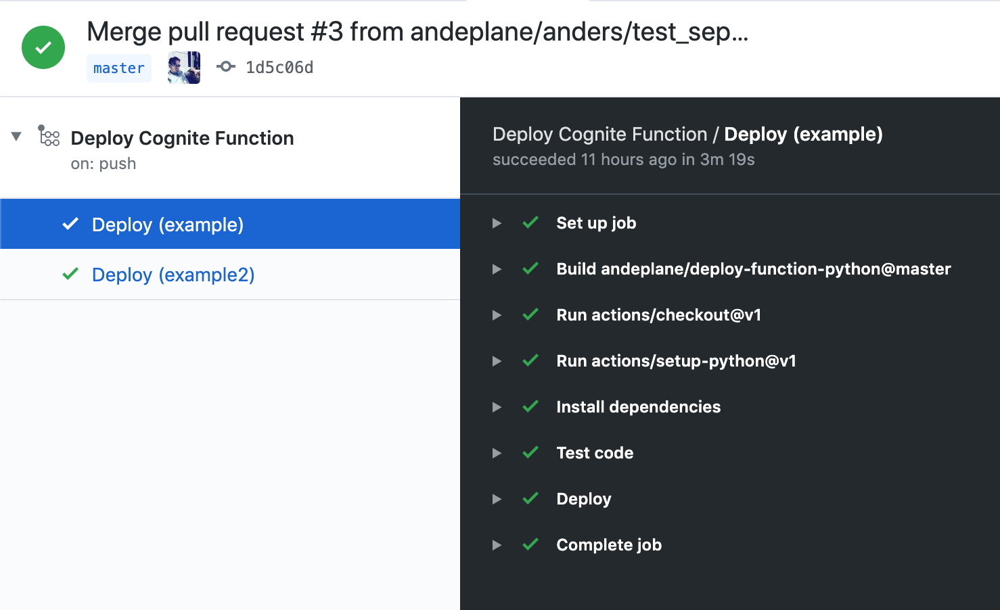

# Cognite function template

This repository can be used as a template to use Cognite Functions with a CI/CD pipeline leveraging GitHub actions. This repository uses a GitHub action from github.com/andeplane/deploy-function-python which gives you
 - Automatic testing and deployment of Cognite functions per repository
 - Unit tests on the functions
 - Integration tests on deployed functions
 - Deployed PR functions for each pull request that integration tests are being performed on
 - A function deployed with latest master

This is currently a work in progress, but works like a proof of concept on how a CI/CD pipeline can be built with GitHub actions on top of Cognite Functions.

# How to use it
## Create a repository with this template
First, click the green [Use this template](https://github.com/andeplane/test-deploy/generate) button to create a repository from this template.
## Modify the template
You will most likely rename the function folders from `example` and `example2` to something else. Do whatever changes you want to do in the functions folders. You can create as many functions as you want in one repository.

Go into Settings in your repository to create one or more secrets. You need at least an API key to deploy the functions.

Once you have modified the functions and added secrets, modify the files in .github/workflows. These are the things you will have to modify:
 - [List of functions](https://github.com/andeplane/test-deploy/blob/master/.github/workflows/deploy-pr.yaml#L11)
 - [Variables to the unit tests](https://github.com/andeplane/test-deploy/blob/master/.github/workflows/deploy-pr.yaml#L24)
 - [Input to the deployment action](https://github.com/andeplane/test-deploy/blob/master/.github/workflows/deploy-pr.yaml#L32). 
 - [Variables to the integration tests](https://github.com/andeplane/test-deploy/blob/master/.github/workflows/deploy-pr.yaml#L39)

This has to be repeated for the [different workflows](https://github.com/andeplane/test-deploy/tree/master/.github/workflows).
